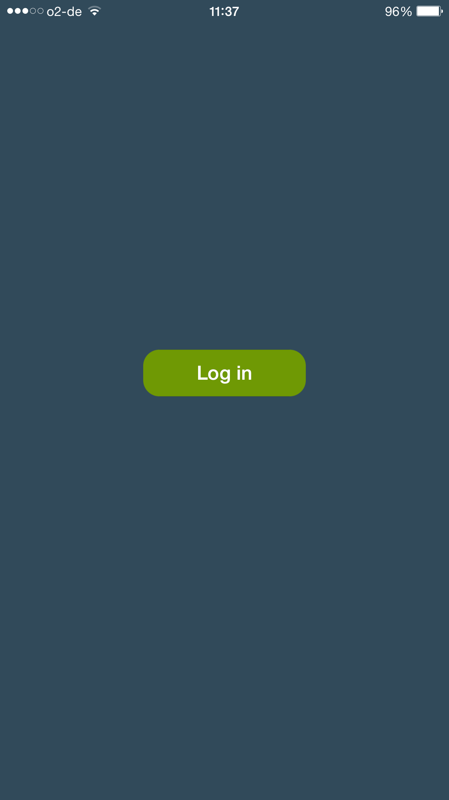
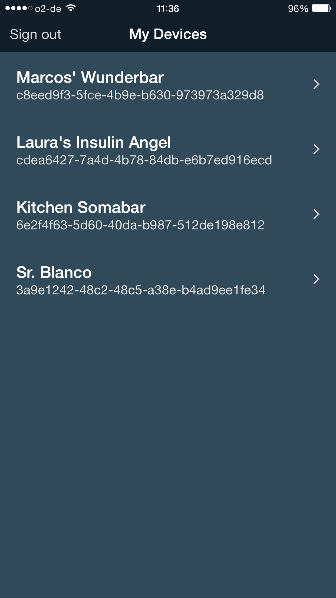
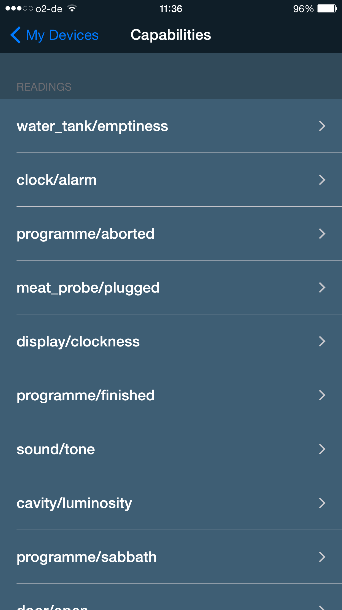

# The HackTheHouse App

**HackTheHouse** was created specifically for the Bosch-Home-Connect hackathon which took place in February 2015. 

The App exemplifies how to connect to a Bosch Home-Connect device, send a command to it and receive data from it.

The app also allows to receive data from your WunderBar sensors. 

##### Log in

##### Choose your device

##### Get your readings or send a command

